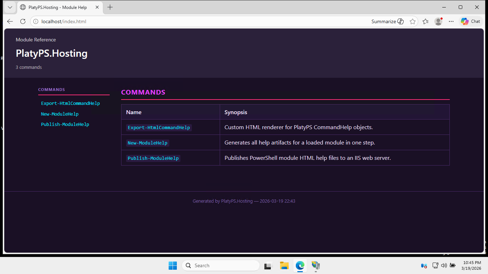
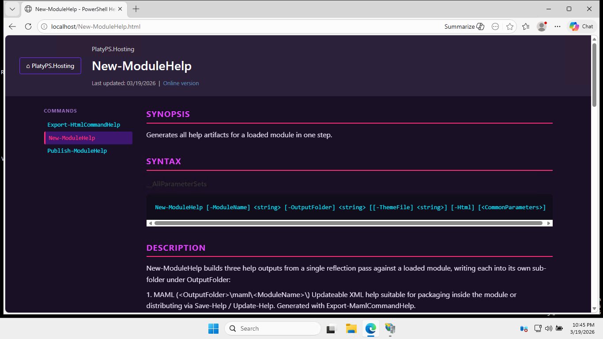
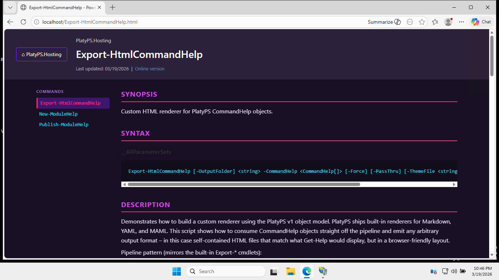
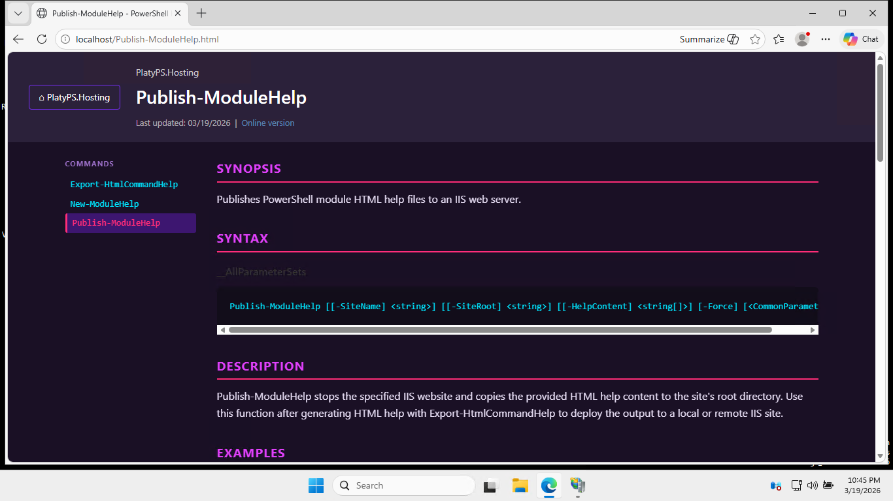

# PlatyPS.Hosting

PlatyPS.Hosting is a PowerShell module that extends the [Microsoft.PowerShell.PlatyPS](https://github.com/PowerShell/platyPS) v1 help authoring workflow. It provides commands that together let you go from a loaded module to a published, browser-friendly HTML documentation site — hosted on IIS or served as a static Hugo site.

```
New-ModuleHelp          # reflection → MAML + Markdown (+ optional HTML)
Export-HtmlCommandHelp  # CommandHelp objects → static HTML site
Publish-ModuleHelp      # HTML files → IIS web server (local or remote)
ConvertTo-HugoFormat    # PlatyPS Markdown → Hugo-compatible content
```



---

## Requirements

| Requirement | Notes |
|-------------|-------|
| PowerShell 5.1 or 7+ | |
| [Microsoft.PowerShell.PlatyPS](https://github.com/PowerShell/platyPS) | `Install-Module Microsoft.PowerShell.PlatyPS` |
| WebAdministration module | Needed for `Stop-Website` / `Start-Website` on the IIS host |
| IIS installed on the target server | Local or remote |
| Appropriate permissions | Stop/start IIS sites; write to the site root |

---

## Installation

### Windows PowerShell

```powershell
Install-Module PlatyPS.Hosting
```

### PowerShell 7+

```powershell
Install-PSResource PlatyPS.Hosting
```

---

## Commands

### `New-ModuleHelp`

Generates all help artifacts for a loaded module in a single pass.

Performs one reflection pass against the live module and writes up to three outputs into sub-folders under `OutputFolder`:

| Output | Path | Tool used |
|--------|------|-----------|
| MAML XML | `<OutputFolder>\maml\<ModuleName>\` | `Export-MamlCommandHelp` |
| Markdown | `<OutputFolder>\markdown\<ModuleName>\` | `New-MarkdownCommandHelp` |
| HTML site *(optional)* | `<OutputFolder>\html\<ModuleName>\` | `Export-HtmlCommandHelp` |

> **Note:** HTML is generated from the Markdown files rather than from live reflection, so any hand-edited descriptions, examples, and notes are included. On subsequent runs, use `Update-MarkdownCommandHelp` to preserve hand-written Markdown content before regenerating HTML.

#### Syntax

```powershell
New-ModuleHelp
    -ModuleName <String>
    -OutputFolder <String>
    [-Html]
    [-ThemeFile <String>]
```

#### Parameters

| Parameter | Type | Required | Description |
|-----------|------|----------|-------------|
| `ModuleName` | `String` | Yes | Name of the module to generate help for. The module must already be loaded in the current session. |
| `OutputFolder` | `String` | Yes | Root folder for the generated artifacts. Created automatically if it does not exist. |
| `Html` | `Switch` | No | Also produce a static HTML site under `<OutputFolder>\html\`. |
| `ThemeFile` | `String` | No | Path to a `.psd1` theme file passed through to `Export-HtmlCommandHelp`. See [Themes](#themes). |

#### Examples

```powershell
# MAML + Markdown only
Import-Module MyModule

$helpSplat = @{
    ModuleName   = 'MyModule'
    OutputFolder = '.\docs'
}
New-ModuleHelp @helpSplat

# MAML + Markdown + HTML with the Dracula theme
$helpSplat = @{
    ModuleName   = 'MyModule'
    OutputFolder = '.\docs'
    Html         = $true
    ThemeFile    = '.\themes\Dracula.psd1'
}
New-ModuleHelp @helpSplat
```



---

### `Export-HtmlCommandHelp`

Converts PlatyPS `CommandHelp` objects into a self-contained static HTML documentation site.

Accepts `CommandHelp` objects on the pipeline (from `New-CommandHelp` or `Import-MarkdownCommandHelp`) and writes one HTML page per command plus an `index.html` module landing page. All pages share a sidebar for navigation.

#### Syntax

```powershell
Export-HtmlCommandHelp
    -CommandHelp <CommandHelp[]>
    [-OutputFolder] <String>
    [-ThemeFile <String>]
    [-Force]
    [-PassThru]
```

#### Parameters

| Parameter | Type | Required | Description |
|-----------|------|----------|-------------|
| `CommandHelp` | `CommandHelp[]` | Yes | One or more PlatyPS `CommandHelp` objects. Accepts pipeline input. |
| `OutputFolder` | `String` | Yes | Root folder for the HTML files. A sub-folder named after the module is created automatically. |
| `ThemeFile` | `String` | No | Path to a `.psd1` theme file. Keys present in the file override the built-in defaults; missing keys keep their default values. See [Themes](#themes). |
| `Force` | `Switch` | No | Overwrite existing HTML files without prompting. |
| `PassThru` | `Switch` | No | Emit the generated `FileInfo` objects to the pipeline. |

#### Examples

```powershell
# From live reflection
$exportSplat = @{
    OutputFolder = '.\help\html'
    Force        = $true
}
Get-Command -Module MyModule | New-CommandHelp | Export-HtmlCommandHelp @exportSplat

# From existing Markdown files
$exportSplat = @{
    OutputFolder = '.\help\html'
    ThemeFile    = '.\themes\Synthwave.psd1'
    Force        = $true
}
Measure-PlatyPSMarkdown -Path .\docs\MyModule\*.md |
    Where-Object Filetype -match 'CommandHelp' |
    Import-MarkdownCommandHelp -Path { $_.FilePath } |
    Export-HtmlCommandHelp @exportSplat
```



---

### `Publish-ModuleHelp`

Publishes generated HTML help files to an IIS web server.

Stops the specified IIS site, copies the HTML content to the site root, and restarts the site. Supports both local deployments and remote deployments over PowerShell remoting.

#### Syntax

```powershell
Publish-ModuleHelp
    [-SiteName <String>]
    [-SiteRoot <String>]
    [-HelpContent <String[]>]
    [-Computername <String>]
    [-Credential <PSCredential>]
    [-Force]
```

#### Parameters

| Parameter | Type | Description |
|-----------|------|-------------|
| `SiteName` | `String` | The name of the IIS site to publish to. Stopped before the copy and restarted afterward. |
| `SiteRoot` | `String` | File system path to the IIS site root on the target machine where files will be copied. |
| `HelpContent` | `String[]` | One or more local paths to HTML files or folders to deploy. |
| `Computername` | `String` | Remote host running IIS. When provided, files are transferred via a PSSession and IIS commands run remotely. Omit for a local deployment. |
| `Credential` | `PSCredential` | Credentials for the remote connection. Uses the current user if omitted. |
| `Force` | `Switch` | Overwrite existing files in the destination without prompting. |

#### Examples

```powershell
# Local deployment
$publishSplat = @{
    SiteName    = 'MyDocsSite'
    SiteRoot    = 'C:\inetpub\mydocssite'
    HelpContent = '.\help\html\MyModule'
    Force       = $true
}
Publish-ModuleHelp @publishSplat

# Remote deployment
$publishSplat = @{
    SiteName    = 'MyDocsSite'
    SiteRoot    = 'C:\inetpub\mydocssite'
    HelpContent = (Get-ChildItem .\help\html -Filter *.html -Recurse).FullName
    Computername = 'webserver01'
    Credential  = Get-Credential
    Force       = $true
}
Publish-ModuleHelp @publishSplat
```



---

### `ConvertTo-HugoFormat`

Converts PlatyPS-generated Markdown files into Hugo-compatible content pages.

Rewrites PlatyPS YAML front matter to Hugo front matter, renames module pages to `_index.md` (Hugo branch bundle convention), cleans up the `__AllParameterSets` syntax subheading, and resolves unset alias placeholders. With `-RootIndex`, also generates a root `content/_index.md` home page derived from the module description and cmdlet synopses.

#### Syntax

```powershell
ConvertTo-HugoFormat
    -Path <String[]>
    -OutputFolder <String>
    [-RootIndex]
    [-Force]
    [-PassThru]
```

#### Parameters

| Parameter | Type | Required | Description |
|-----------|------|----------|-------------|
| `Path` | `String[]` | Yes | Path to one or more PlatyPS Markdown files, or a directory containing them. Accepts pipeline input. |
| `OutputFolder` | `String` | Yes | Destination folder for the converted files. Created automatically if it does not exist. |
| `RootIndex` | `Switch` | No | When processing a directory, also generate a root `content/_index.md` one level above `OutputFolder`. |
| `Force` | `Switch` | No | Overwrite existing output files without prompting. |
| `PassThru` | `Switch` | No | Emit the generated `FileInfo` objects to the pipeline. |

#### Examples

```powershell
# Convert all PlatyPS Markdown and generate a root index page
$hugoSplat = @{
    Path         = '.\help\markdown\PlatyPS.Hosting'
    OutputFolder = '.\hugo\content\PlatyPS.Hosting'
    RootIndex    = $true
    Force        = $true
}
ConvertTo-HugoFormat @hugoSplat
```

---

## Themes

Three built-in themes ship with the module under the `themes\` folder. Pass the path to any of them via `-ThemeFile` on `Export-HtmlCommandHelp` or `New-ModuleHelp`.

| File | Description |
|------|-------------|
| `themes\Default.psd1` | Clean light theme with a navy/blue accent (Microsoft-inspired) |
| `themes\Dracula.psd1` | Dark theme using the Dracula color palette |
| `themes\Synthwave.psd1` | Dark theme with neon/retro Synthwave colors |

To create a custom theme, copy `Default.psd1` and override only the keys you want to change. Any key not present in your file falls back to the built-in default automatically.

```powershell
$helpSplat = @{
    ModuleName   = 'MyModule'
    OutputFolder = '.\docs'
    Html         = $true
    ThemeFile    = '.\themes\Dracula.psd1'
}
New-ModuleHelp @helpSplat
```

---

## Hugo Site

In addition to the IIS HTML renderer, PlatyPS.Hosting includes a Hugo site configuration under `hugo/` using the [Relearn](https://mcshelby.github.io/hugo-theme-relearn/) theme. Use `ConvertTo-HugoFormat` to populate the content from your PlatyPS Markdown files, then serve or deploy with Hugo.

### Quick start

```powershell
# Convert PlatyPS Markdown to Hugo content
$hugoSplat = @{
    Path         = '.\help\markdown\PlatyPS.Hosting'
    OutputFolder = '.\hugo\content\PlatyPS.Hosting'
    RootIndex    = $true
    Force        = $true
}
ConvertTo-HugoFormat @hugoSplat

# Serve locally
Set-Location .\hugo
hugo server
```

### Deploy to GitHub Pages

A GitHub Actions workflow at `.github/workflows/hugo.yml` builds the Hugo site on every push to `main` and deploys it to GitHub Pages. To enable it:

1. Go to **Settings → Pages** and set the source to **GitHub Actions**.
2. Push to `main` — the workflow handles the rest.

---

## End-to-End Workflow

```powershell
Import-Module Microsoft.PowerShell.PlatyPS
Import-Module .\PlatyPS.Hosting.psd1
Import-Module MyModule

# 1. Generate MAML, Markdown, and HTML
$helpSplat = @{
    ModuleName   = 'MyModule'
    OutputFolder = '.\help'
    Html         = $true
    ThemeFile    = '.\themes\Dracula.psd1'
}
New-ModuleHelp @helpSplat

# 2a. Publish to a local IIS site
$publishSplat = @{
    SiteName    = 'MyDocsSite'
    SiteRoot    = 'C:\inetpub\mydocssite'
    HelpContent = '.\help\html\MyModule'
    Force       = $true
}
Publish-ModuleHelp @publishSplat

# 2b. (or) Convert to Hugo and serve
$hugoSplat = @{
    Path         = '.\help\markdown\MyModule'
    OutputFolder = '.\hugo\content\MyModule'
    RootIndex    = $true
    Force        = $true
}
ConvertTo-HugoFormat @hugoSplat
hugo server -s .\hugo
```

---

## Related Links

- [Microsoft.PowerShell.PlatyPS on GitHub](https://github.com/PowerShell/platyPS)
- [IIS WebAdministration module](https://learn.microsoft.com/en-us/powershell/module/webadministration/)
- [Hugo Relearn theme](https://mcshelby.github.io/hugo-theme-relearn/)
